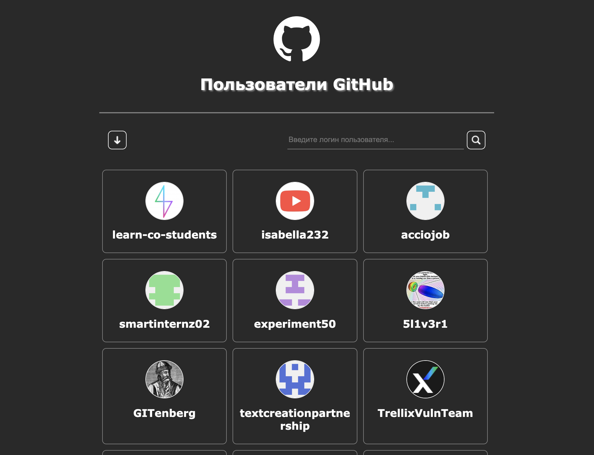
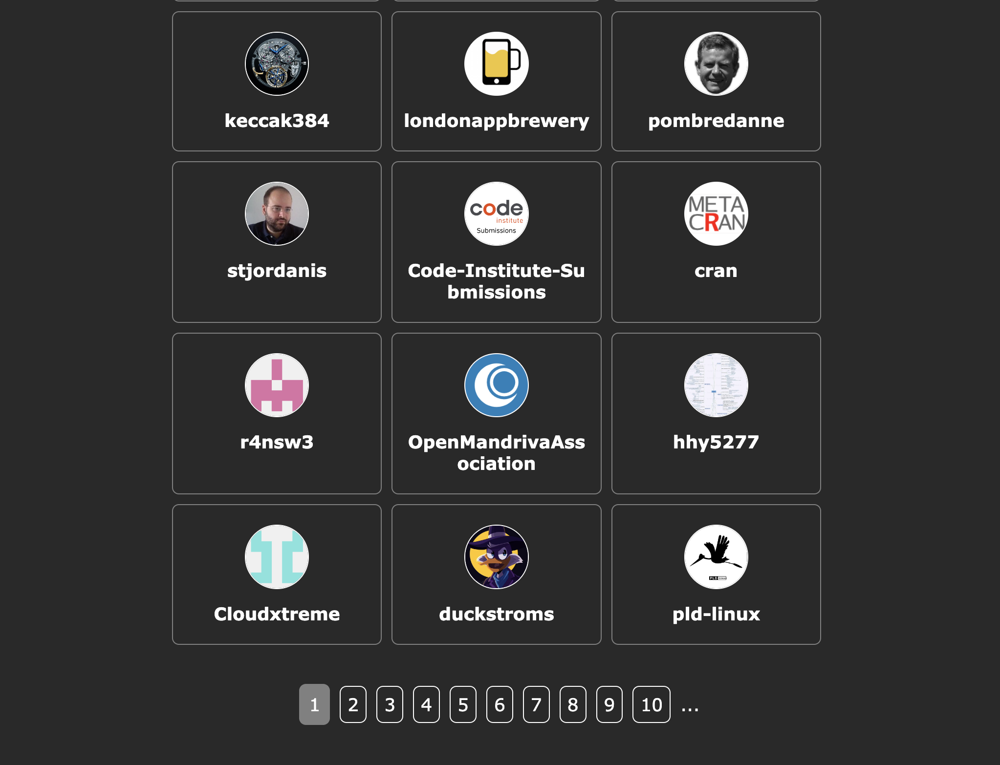
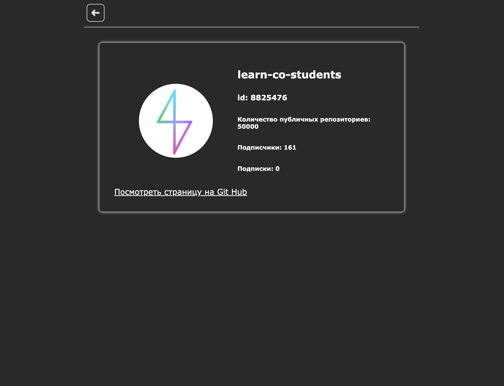
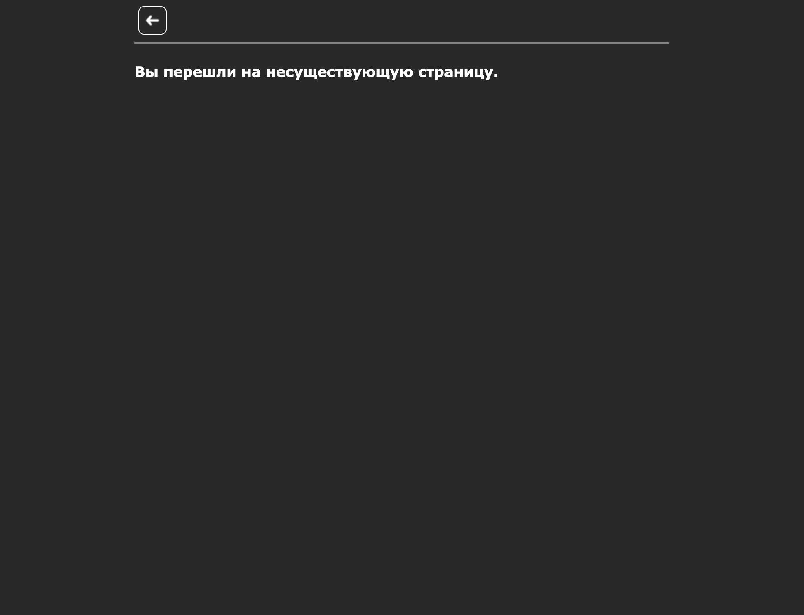

# Users_GitHubAPI

#### Данное приложение реализовано с помощью JavaScript-библиотеки – React.

## Available Scripts

In the project directory, you can run:

### `npm start`

Runs the app in the development mode.\
Open [http://localhost:3000](http://localhost:3000) to view it in your browser.

### `npm test`

Launches the test runner in the interactive watch mode.

### Главная страница 

#### _screenshot(1)_

#### _screenshot(2)_

### Страница с информацией о выбранном пользователе

#### _screenshot(1)_

### Страница с ошибкой в случае перехода по некорректно заданному URL

#### _screenshot(1)_

